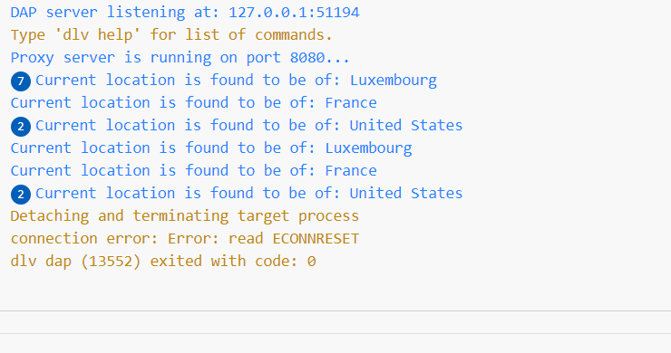

# Location based redirection service in golang

A Golang-based location based redirection service that redirects incoming requests to backend servers based on the client's location (URL mapping rules). The proxy server supports location-based server selection for global scalability.

## Table of Contents

- [Background](#background)
- [Features](#features)
- [Installation](#installation)
- [Usage](#usage)
- [Configuration](#configuration)
- [Testing](#testing)
- [Screenshots](#screenshots)
- [Contributing](#contributing)
- [License](#license)

## Background

In cloud-deployed systems, scalability is crucial to handle on-demand requests efficiently. This location based redirection service allows redirection of incoming requests to backend servers based on customizable URL mapping rules. Each incoming URL can be redirected to different backend servers avoiding reliance on a single server.

## Features

- **URL Mapping**: Customize URL mapping rules to redirect incoming requests to specific backend servers.
- **Location-Based Server Selection**: Redirects requests based on the client's location, ensuring optimal performance for global users.
- **Error Handling**: Handles cases where no mapping is found and returns a "Not Found" response (404).
- **Configurable**: Easily modify the mapping rules through the JSON configuration file.
- **Testing**: Includes comprehensive unit tests to ensure the correctness of the redirection process.

## Installation

1. Clone the repository to your local machine:

```bash
git clone https://github.com/garghub/location_based_redirection_golang.git
```

2. Change into the project directory:

```bash
cd location_based_redirection_golang
```

3. Install the necessary dependencies:

```bash
go mod download
```

## Usage

1. Customize the IP address location mapping rules in the `mapping_rules.json` file. Add the path, locations, and their corresponding backend URLs. For example, a client is connecting via an IP address that, as per [IP-API](https://ip-api.com/), is in Australia, then a new location with "Australia" and an appropriate redirecting URL can be added. Here is an example of the existing mapping:

```json
{
    "rules": [
        {
            "path": "/search",
            "locations": {
                "United States": "https://duckduckgo.com/?q=news",
                "Luxembourg": "https://www.bing.com/search?q=news",
                "Default": "https://www.google.com/search?q=news"
            }
        }
    ]
}
```

2. Run the proxy server:

```bash
go run main.go
```

3. The proxy server will run on port 8080.

## Configuration

The configuration file `mapping_rules.json` is used to set up the URL mapping rules for the proxy server. Customize the file with the desired URL paths and their corresponding backend URLs. You can add more rules to support additional paths.

## Testing

To run the unit tests, execute the following command:

```bash
go test
```

## Screenshots

1. Location identification based on IP address



2. URL redirection to [Bing](https://www.bing.com/search?q=news) for clients in Luxembourg


3. URL redirection to [Duckduckgo](https://duckduckgo.com/?q=news) for clients in US


4. URL redirection to [Google](https://www.google.com/search?q=news) for clients in any location other than US and Luxembourg


5. Page Not Found (404) is shown in case of an incorrect URL


## Project Status

This project is being maintained and improved. I intend to follow best practices in development and welcome feedback.


## License

This project is licensed under the [MIT License](LICENSE).

---
